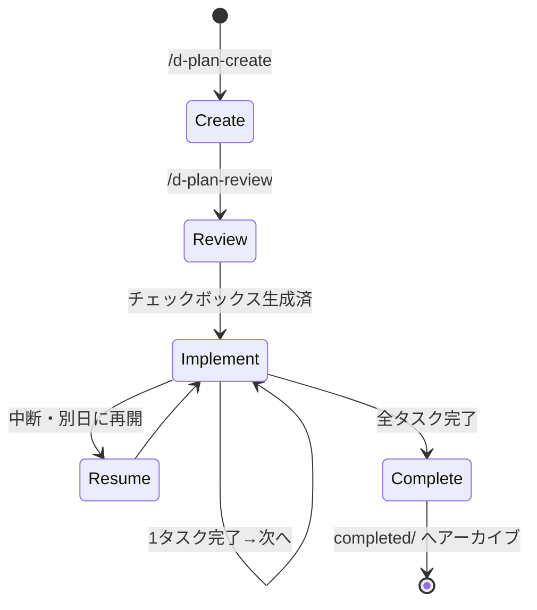
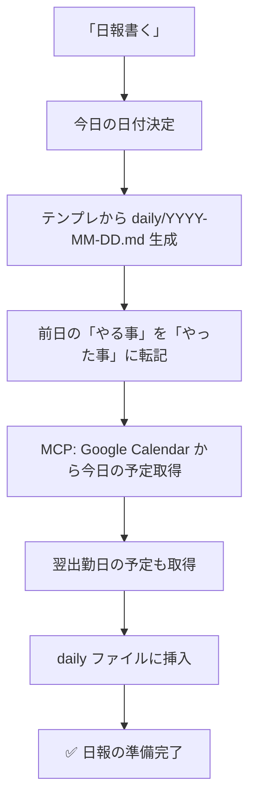
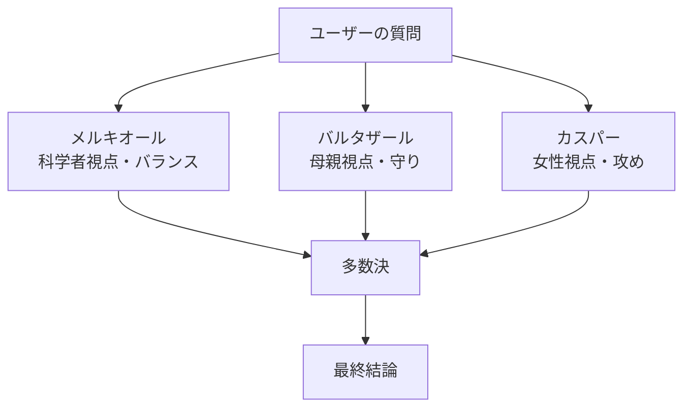
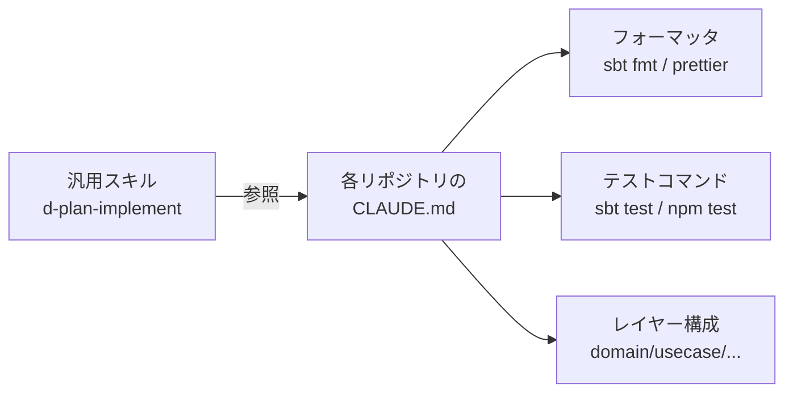

:::message
本記事は Claude に下書きを生成させ、筆者が事実確認・構成調整・加筆修正を行ったものです。スキルの実装や設計判断はすべて筆者本人によるものです。
:::

## 🚀 はじめに

Claude Code を毎日使っているうちに、「いつも同じ指示してるな」「同じ手順踏んでるな」と感じる場面が増えてきました。

そこで Claude Code の **カスタムスキル機能** を使って個人ワークフローを17個ほど作ったところ、想像以上に手放せなくなったので、設計方針と実例をまとめます。

:::message
**対象読者**
- Claude Code をすでに使っている人
- 「同じプロンプト何度も書いてる」と感じている人
- dotfiles に Claude 設定を載せて再現性を担保したい人
:::

## 🧩 カスタムスキルとは

Claude Code は `~/.claude/skills/<skill-name>/SKILL.md` に Markdown を置くと、それを **スキル**（≒ パラメータ付きの定型プロンプト + ツール権限）として呼び出せます。

```
~/.claude/skills/
└── my-skill/
    └── SKILL.md
```

`SKILL.md` の冒頭にフロントマターを書くだけで、スラッシュコマンド（`/my-skill`）として呼べたり、自然言語のトリガーで自動発火させたりできます。

```yaml
---
name: my-skill
description: "何をするスキルか（自動発火のトリガーにも使われる）"
user-invocable: true
disable-model-invocation: false
allowed-tools: Read, Write, Bash
argument-hint: "[引数の説明]"
---
```

ポイントは `description` です。**この文章を元に Claude が「今このスキルを呼ぶべきか」を判断する**ので、トリガー条件は明示的に書きます。

:::message alert
`description` が曖昧だと自動発火しません。「〜と言われた時に使用する」まで書き切るのが鉄則。
:::

## 📂 dotfiles に載せて配布

スキルは個人資産なので、`.claude/` ごと dotfiles に入れて GNU Stow でシンボリックリンクするだけです。

```
~/.dotfiles/settings/claude/.claude/
├── settings.json    ← permissions等
└── skills/
    └── d-*/SKILL.md
```

```bash
stow -d ~/.dotfiles/settings -t $HOME claude
```

`git pull` するだけで全マシンに新しいスキルが行き渡る。stow による dotfiles 管理自体は既出記事が多いので、詳しくは [公開リポジトリ](https://github.com/ugdark/dotfiles) を参照してください。

## 🏷️ Claude Code 固有のディレクトリ作法

スキルを増やしていく中で気づいた、Claude Code ならではの設計コツを紹介します。

### `d-` プレフィックスで名前空間を作る

筆者は自作スキル全てに `d-` プレフィックス（GitHub ID `ugdark` の "d" から）を付けています。

```
~/.claude/skills/
├── code-review/        ← 組み込み or プラグイン
├── deep-research/      ← 同上
├── d-plan-create/      ← 自作
├── d-plan-implement/   ← 自作
└── d-sql/              ← 自作
```

これで `/d-` を打てば自分のスキルだけが補完候補に出てきます。組み込みや他プラグインとの衝突を防げるだけでなく、**プロジェクト固有スキルとの重複も避けられる**のが地味に効きます。

たとえば筆者は個人版 `d-pre-review`（ローカルコードレビュー）を持っていますが、プロジェクト側にも `pre-review` という同等スキルが存在することがあります。

| 名前 | 出所 | 役割 |
|------|------|------|
| `pre-review` | プロジェクト `.claude/skills/` | プロジェクト独自ルールでのレビュー |
| `d-pre-review` | `~/.claude/skills/` | プロジェクト非依存の個人ワークフロー版 |

`d-` プレフィックスのおかげで「**プロジェクトのスキルを上書きせず、個人版として共存できる**」。プロジェクトに参画している他メンバーには影響を与えずに、自分だけ個人スキルを併用できるわけです。

### 手動 / 自動発火の使い分け

フロントマターの2つのフラグで挙動が変わります。

| `user-invocable` | `disable-model-invocation` | 挙動 | 使いどころ |
|:-:|:-:|------|-----------|
| `true` | `false` | スラッシュコマンド & 自然言語で自動発火 | 日常スキル（`d-note`, `d-sql`） |
| `true` | `true` | スラッシュコマンド **のみ**、自動発火しない | 副作用大きい / 遊び系（`d-persona`, `d-magi`） |

「`/d-magi` は明示的に呼びたい時だけ動いてほしい」みたいな制御はこれでやります。`description` が良すぎると意図せず発火しちゃうので、抑えたいなら `disable-model-invocation: true`。

### `allowed-tools` で権限を最小化

スキルごとに使えるツールを絞れます。

```yaml
# 読むだけのスキル
allowed-tools: Read, Glob, Grep

# planを書き換えるスキル
allowed-tools: Read, Edit, Write, Bash, Glob

# MCPを使うスキル
allowed-tools: Read, Write, Edit, Bash, mcp__claude_ai_Google_Calendar__list_events
```

「`d-note` がうっかり `rm` を叩く」みたいな事故を構造的に防げます。

### settings.json も dotfiles に載せる

スキルだけ揃えても、`Bash(rm:*)` を許可するか確認するか、みたいなのは `settings.json` 側です。これも一緒に dotfiles に載せておくと完璧。

```json
{
  "permissions": {
    "allow": ["Read", "Glob", "Grep", "Bash(git status:*)", "Bash(git diff:*)"],
    "deny":  ["Bash(rm -rf:*)", "Bash(git push --force:*)"]
  }
}
```

筆者は **Read/Glob/Grep は全許可、Edit/Write はパス制限、Bash はパターン個別許可、破壊的操作は deny で明示** という方針にしています。

## 🔁 実例1: Plan駆動シリーズ — 長期タスクを Claude に任せる5本柱

最も使うのが Plan 駆動シリーズです。

| スキル | 役割 |
|--------|------|
| `d-plan-create` | 新規plan作成（feature/bugfix/investigation のテンプレ） |
| `d-plan-review` | 要望を分析しタスク分解・完了条件を自動記載 |
| `d-plan-implement` | チェックボックスを1つずつ実装→ユーザー確認 |
| `d-plan-complete` | チェック確認後、planを completed へアーカイブ |
| `d-plan-resume` | active planの進捗確認と次タスクの提案 |



planファイル自体は単なる Markdown ですが、

```markdown
## 対応状況

- [ ] テーブル作成 migration を追加する
- [ ] repository層の実装
- [ ] usecase層の実装
- [ ] テスト追加
```

このチェックボックスを **1個ずつ実装 → ユーザー確認 → チェック → 次へ** という流れに固定したことで、「Claude が暴走して10ファイル一気に書き換える」事故が激減しました。

> 💡 `d-plan-resume` を使うと、別日に作業再開してもどこから続けるか迷わない。Claude 自身が active plan を読んで「次はこのタスクですね」と提案してくれます。

## ⚡ 実例2: 一発系 — 「いつもやってる作業」を1コマンド化

### 📝 d-note: 軽いメモ追記

```
「これメモっといて」
```

と言うだけで `~/.dotfiles/vault/note.md` の末尾に、直前の会話の要点を3〜10行で要約して追記します。「planにするほどじゃないけど忘れたくない話」専用の置き場所です。

### 🗄️ d-sql: Sequel Ace 接続を流用して MySQL を叩く

Mac で MySQL クライアントといえば Sequel Ace ですが、接続情報を CLI からも使いたい。Sequel Ace の Favorites を読んでラッパースクリプト経由で接続するようにしたら、Claude に「`localdb` の `users` テーブル見せて」と言うだけで結果が返るようになりました。

| 接続種別 | 判定 | 権限 |
|----------|------|------|
| local | `dev(` `stage(` 以外 | 全SQL可（破壊的SQLは確認） |
| dev    | `dev(` で始まる接続名 | SELECT のみ |
| stage  | `stage(` で始まる接続名 | SELECT のみ |

### 📅 d-daily-start: 日報の自動準備

```
「日報書く」
```

の一言で:



ここでポイントなのが Claude Code の **MCP（Model Context Protocol）連携** です。`mcp__claude_ai_Google_Calendar__list_events` を `allowed-tools` に書いておくと、スキルから直接カレンダーAPIを叩けます。

## 🎭 実例3: 遊び心系 — でも実用

### d-persona: 人格切り替え

```
/d-persona louise   # ルイズ（ツンデレ毒舌、ズバズバ指摘型）
/d-persona gendou   # 碇ゲンドウ（否定的視点で問題を突く）
```

冗談みたいですが、これが意外と効きます。

> 「甘いわよ。その程度の考慮じゃ本番で死ぬわ」

曖昧な設計を持っていくとこう返してくる装置として機能します。**AIの遠慮を強制的に削ぐ**のが狙い。

### d-magi: 3並列エージェントで多数決判定

エヴァンゲリオンの MAGI システムをモチーフにしたスキル。`Agent` ツールで **3つのサブエージェントを並列起動**して別視点（攻め/守り/バランス）から分析させ、多数決で結論を出します。



技術選定や設計判断で「自分の思い込みじゃないか確認したい」時に使います。3体が分かれた結論を出すと「あ、これ本当に難しい問題だな」と気付ける。

## 📐 設計の3原則

17個作ってみてわかった、汎用スキルにすべき / プロジェクト固有にすべきの線引きです。

### 1️⃣ プロダクト・言語に依存しない

`d-plan-implement` に `sbt format` や `npm test` をハードコードしない。テストコマンドはプロジェクトの `CLAUDE.md` に書かせ、スキルはそれを参照します。

### 2️⃣ プロジェクト固有は CLAUDE.md に委任



各リポジトリの `CLAUDE.md` がスキルに対する設定ファイル代わりになります。スキル側は「`CLAUDE.md` の設定を確認して実行」とだけ書く。

### 3️⃣ テンプレートはシンプルに

planテンプレートに「結論」「背景」「代替案」「リスク」みたいな見出しを乱立させない。構造だけ置いて、具体的な内容は review 時に Claude に埋めさせる。

## 🐛 ハマったところ

:::message
**スキル実行直後の AskUserQuestion が表示されないことがある**

スキル実行 → 即 `AskUserQuestion` という流れで、たまにダイアログがスキップされる現象に遭遇。回避策として「最初に必ず AskUserQuestion を実行する」と SKILL.md に明示していますが、根本解決には至っていません。
:::

:::message
**Bash 確認プロンプトの取り扱い**

`allowed-tools: Bash` と書いても、コマンドによっては `settings.json` の `permissions.allow` に追加しないと毎回確認が出ます。よく使うコマンドだけ allow し、破壊的操作は deny に明示しておくとバランスが取れます。
:::

## 🎁 まとめ

| ポイント | 一言で |
|----------|--------|
| カスタムスキル | ツール権限付きの定型プロンプト |
| 配布戦略 | dotfiles + stow で全マシンに |
| plan駆動 | 1チェックボックスずつで暴走防止 |
| MCP連携 | 外部サービス（カレンダー等）も操作可能 |
| 設計原則 | 汎用スキル + プロジェクト固有は `CLAUDE.md` |

「Claude Code を使ってるけど、毎回同じこと指示してる気がする」という人は、その繰り返し部分をスキル化することから始めてみてください。

筆者のdotfiles: https://github.com/ugdark/dotfiles
