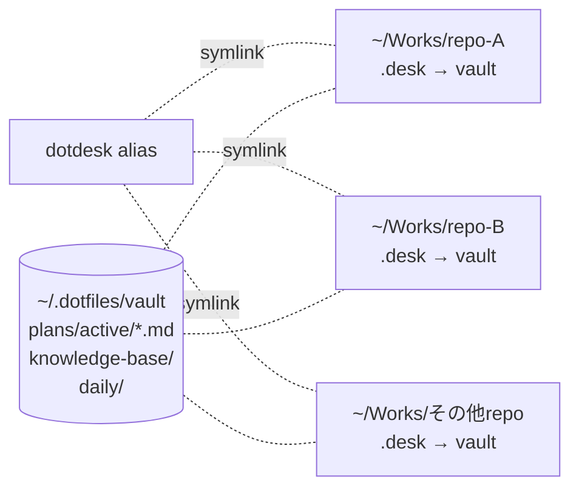
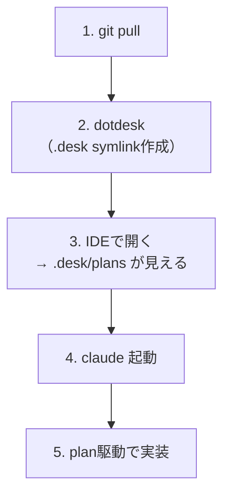
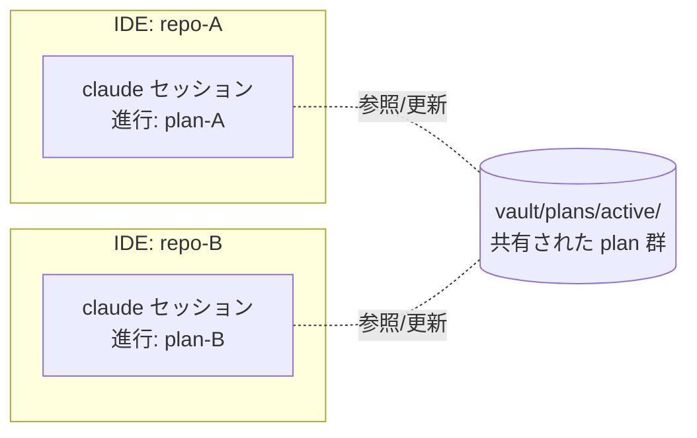

:::message
本記事は Claude に下書きを生成させ、筆者が事実確認・構成調整・加筆修正を行ったものです。設計や運用フローはすべて筆者本人によるものです。
:::

## 🚀 はじめに

[前回の記事](https://zenn.dev/ugdark/articles/claude-code-personal-skills) で Claude Code のカスタムスキルを17個作った話を書きました。その中で **plan駆動** という運用に少し触れたのですが、これを **複数リポジトリを横断しながら並列で回す** 運用について書きます。

軸は以下のとおり：

- **1 repo = 1 IDE = 1 Claude** をルール化（同一repoでセッション分けない）
- 並列は **別repoで動かす**（必要なら同一repoを別cloneして物理的に分ける）
- repo 間の連絡は plan ファイル経由
- 思想は **TOYOTA の「自働化」**（人が要所で入る）
- 実装は **1行 alias + global gitignore** で済む

:::message
**対象読者**
- 複数リポジトリで Claude Code を使っている人
- 「AIに丸投げ」じゃなく「人が要所で入る」運用が好みな人
:::

## 🧩 前提: plan駆動とカスタムスキル

筆者は `d-plan-*` というカスタムスキル群（Claude Code カスタムスキル）で plan ファイルを管理しています。

- スキル本体: [dotfiles/settings/claude/.claude/skills/](https://github.com/ugdark/dotfiles/tree/master/settings/claude/.claude/skills)
- planテンプレ: [d-plan-create/templates/](https://github.com/ugdark/dotfiles/tree/master/settings/claude/.claude/skills/d-plan-create/templates) （feature / bugfix / investigation の3種類）

plan は単なる Markdown で、チェックボックスを **1個ずつ実装 → ユーザー確認 → チェック → 次へ** という流れで Claude Code が進めてくれます。詳しくは [前回記事](https://zenn.dev/ugdark/articles/claude-code-personal-skills) を参照。

## 📂 全体構成



- Obsidian vault が plan / knowledge / daily の **マスター置き場**
- 各リポジトリ直下に `.desk` という symlink を張る
- IDE で repo を開くと `.desk/plans/active/...` が見える状態に

## 🔗 dotdesk の正体 — 1行 alias

`.zshrc` にこれだけ：

```bash
alias dotdesk='ln -snf ~/.dotfiles/vault .desk'
```

これが `dotdesk` の全て。シンプル極まりない。

### 使い方

```bash
cd ~/Works/repo-A
dotdesk                        # .desk symlink が作られる
ls .desk/
# plans/  knowledge-base/  daily/  templates/  ...
```

これで IDE（IntelliJ IDEA / VS Code 等）でこの repo を開くと、左ペインに `.desk/` が現れ、その配下に Obsidian vault 全体が見えるようになります。

## 🙈 .gitignore_global で `.desk` を除外

各 repo の `.gitignore` に `.desk` を追加するのは面倒。なので **global gitignore** で一括除外しています。

```bash
# ~/.gitignore_global
.desk
```

これで `dotdesk` を打っても commit に `.desk` が混入する心配なし。
チーム repo の `.gitignore` を勝手に汚さない、というのも地味に大事。

## 🔄 作業開始ワークフロー

リポジトリで作業を始めるときの流れ：



```bash
cd ~/Works/repo-A
git pull
dotdesk
idea .
claude
```

作業の最後には daily に **進めた plan の状況** を残しています。daily は [d-daily-start](https://github.com/ugdark/dotfiles/blob/master/settings/claude/.claude/skills/d-daily-start/SKILL.md) で前日からの転記＋予定挿入が走るので、そこに進捗を書き足す形で plan と緩く連動させているくらいです。

## 🚦 plan の置き方 — repoと紐づけない

筆者は plan を **リポジトリと紐づけていません**。理由は1つ、**repo横断するタスクがあるから**。

```
vault/plans/active/
├── 20260605_01_validator_plan.md
├── 20260606_01_repoA_task1_plan.md
├── 20260606_02_repoA_task2_plan.md     ← 並列で管理
└── 20260606_03_db_schema_unify_plan.md ← repo横断
```

命名は `YYYYMMDD_NN_description_plan.md` 形式。「どのrepoのplanか」は plan の中身（影響範囲セクション）に書く方針で、ファイル名は素早く識別できればOK。

テンプレ構造の詳細は [feature.md](https://github.com/ugdark/dotfiles/blob/master/settings/claude/.claude/skills/d-plan-create/templates/feature.md) を参照。

## ⚡ 並列の正しい姿

ここが本記事の肝。

### 大原則: 1 repo = 1 IDE = 1 Claude

筆者は **同一repoを2セッションで同時に動かすことはしません**。

- 1つの repo を開くのは **1つの IDE ウィンドウだけ**
- そこで起動する Claude Code も **1セッションだけ**
- repo 間のやりとりは **plan ファイル経由**

「並列」の単位は **repo** であって、**Claude セッション内** ではない。

### 並列の構図



- **別repo** をそれぞれ別 IDE で開いて並行進行
- 各セッションは自分の plan を進める
- plan は vault 上で共有されてるので、片方の進捗をもう片方が参照できる

### plan を「並列管理」する意味

同一repo内で `task1.md` `task2.md` のように plan を分けるのは、**同時に動かす**ためじゃなくて：

| 目的 | 内容 |
|------|------|
| **論点を絞る** | 1 plan に複数論点を混ぜると Claude が迷子になる |
| **完了の手応え** | 小さな粒度で completed に流せる |
| **中断・再開のしやすさ** | `d-plan-resume` で続きから入りやすい |
| **横断管理** | active 一覧で「今こんなのが進行中」と俯瞰できる |

「並列実行」というより「**並列管理**」の感覚に近い。実際に走らせるのは順番に。

### 同一repoで並列したいときは「別clone」

「同じrepoのタスクを2つ並行で進めたい」場合は、**別ディレクトリに `git clone` を増やす**運用です。

```
~/Works/
├── repo-A/         ← メイン作業
├── repo-A_task1/   ← 並列タスク1用 (別clone)
└── repo-A_task2/   ← 並列タスク2用 (別clone)
```

それぞれ独立した `.desk` / IDE / Claude セッション。**「1 repo = 1 IDE = 1 Claude」のルールが保たれる**のがポイント。

### repo 間連携は plan が共有掲示板

A repo の変更が B repo に影響する場合、plan ファイルに **影響範囲セクション** を書いて両 repo を跨ぐタスクとして管理します。

```markdown
## 影響範囲
- repo-A: 変更点（API / スキーマ / etc）
- repo-B: 必要な追従

## 対応状況
- [x] repo-A 側
- [ ] repo-B 側  ← ここを次セッションで
```

A repo 側の Claude セッションを閉じて、B repo の IDE を開き直し、**同じ plan ファイル** を参照しながら続きを進める、という流れ。

Slack や口頭メモではなく、**Markdown ファイル**が情報伝達手段になる。テンプレ詳細は [feature.md](https://github.com/ugdark/dotfiles/blob/master/settings/claude/.claude/skills/d-plan-create/templates/feature.md) 参照。

## 🛠️ 他の AIエージェントオーケストレータとの関係

近い領域に [TAKT](https://github.com/nrslib/takt) のような AI agent オーケストレータがあります。複数の AI を workflow で強制実行して再現性を担保する強力な仕組み。

実は筆者も TAKT の導入を検討しました。が、本記事のスタイルは **alias 1行 + Markdown** で済む軽さがあり、すでにそれなりに回っていたので、乗り換えはせず今のスタイルを継続しています。

両者は方向性が違うので、使い分けに合う設計だと思います：

- **定型化された処理を確実に回したい** → TAKT のようなオーケストレータ
- **探索的・カスタマイズ重視で人が要所で入る** → 本記事のような plan駆動

TAKT については [作者の解説記事](https://zenn.dev/nrs/articles/c6842288a526d7) が分かりやすいので、興味あればそちらもどうぞ。

## 🎁 まとめ

| ポイント | 一言で |
|----------|--------|
| **dotdesk** | `ln -snf ~/.dotfiles/vault .desk` の1行 alias |
| **配布** | global gitignore に `.desk` だけ |
| **plan管理** | repo紐づけしない、`YYYYMMDD_NN_*_plan.md` |
| **1 repo = 1 IDE = 1 Claude** | 同一repoでは1セッションのみ |
| **並列は別repo or 別clone** | worktree でなく物理分離 |
| **repo間連携** | plan ファイルが共有掲示板 |

仕組みは1行のalias、運用は人間の頭で割り振る。**シンプルだけど効く**運用です。

「複数repo、plan散らかる、IDEで見えない、AIエージェント系は重そう」という人はぜひ試してみてください。

---

余談ですが、自分は TOYOTA の **「自働化」** の思想が好きで、だいたいはレビューに重きを置いてます。IDEA などのツールで差分を逐一確認するのを大事にしているのも、その流れです。

---

筆者のdotfiles: https://github.com/ugdark/dotfiles
関連記事: [Claude Code のカスタムスキルで個人ワークフローを17個自動化した話](https://zenn.dev/ugdark/articles/claude-code-personal-skills)
